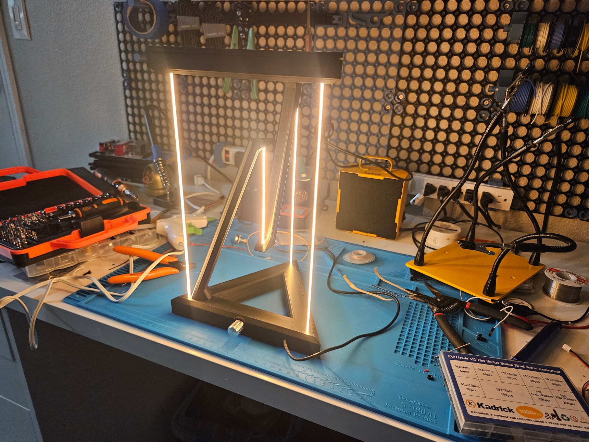
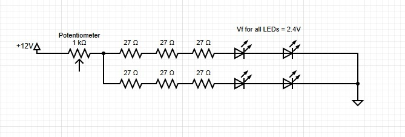

# TensegrityLamp
A 3D-printable tensegrity object that uses LED filament as the tensioning material

https://en.wikipedia.org/wiki/Tensegrity

## Materials List
- ~300g of 3D printing filament
- [3x 300mm LED filament - Yellow](https://a.co/d/0f8OHvWg)
- [1x 130mm LED filament - Yellow](https://a.co/d/0jl5KR5Y)
- 6x 27 Ohm 1/4W resistors
	- These were just the resistors I had laying around. The reason I had to use multiple resistors in parallel-series is due to the power rating of the resistors. The resistors in my lamp were rejecting ~1.5W of power. See the diagram below if you want to calculate your own resistor values.
- Super glue
- [22GA Solid Core Wire](https://a.co/d/052iRSHW)
	- Solid Core is a must, since routing wires through the arm requires 'pushing' the wire through the arm
- Soldering setup
- Wire stippers
- [1x 12V power supply](https://a.co/d/02fEqsVn)
	- You could also do a 9V power supply, but probably not any less than that. Would require recalculating resistors
- [1x 1K Ohm Potentiometer](https://a.co/d/0gW3C4QP)
- [M3 Screws](https://a.co/d/088Ue2zd)
- Electrical Tape/Shrink tubing

## Electrical Diagram

If you do not have exact same components that I do, you can calculate your resistor values here: [DigiKey Calculator.](https://www.digikey.com/en/resources/conversion-calculators/conversion-calculator-led-series-resistor) Make sure to use a forward voltage value of 4.8V, since there are two series LEDs filament strips. The parallel-series combination of resistors is not necessary if you have resistors with an adequate power rating. The fact that the LED filament strips are in a 2x2 parallel-series combination is necessary, however.

## Build Guide
Will do this hopefully in the next couple of days